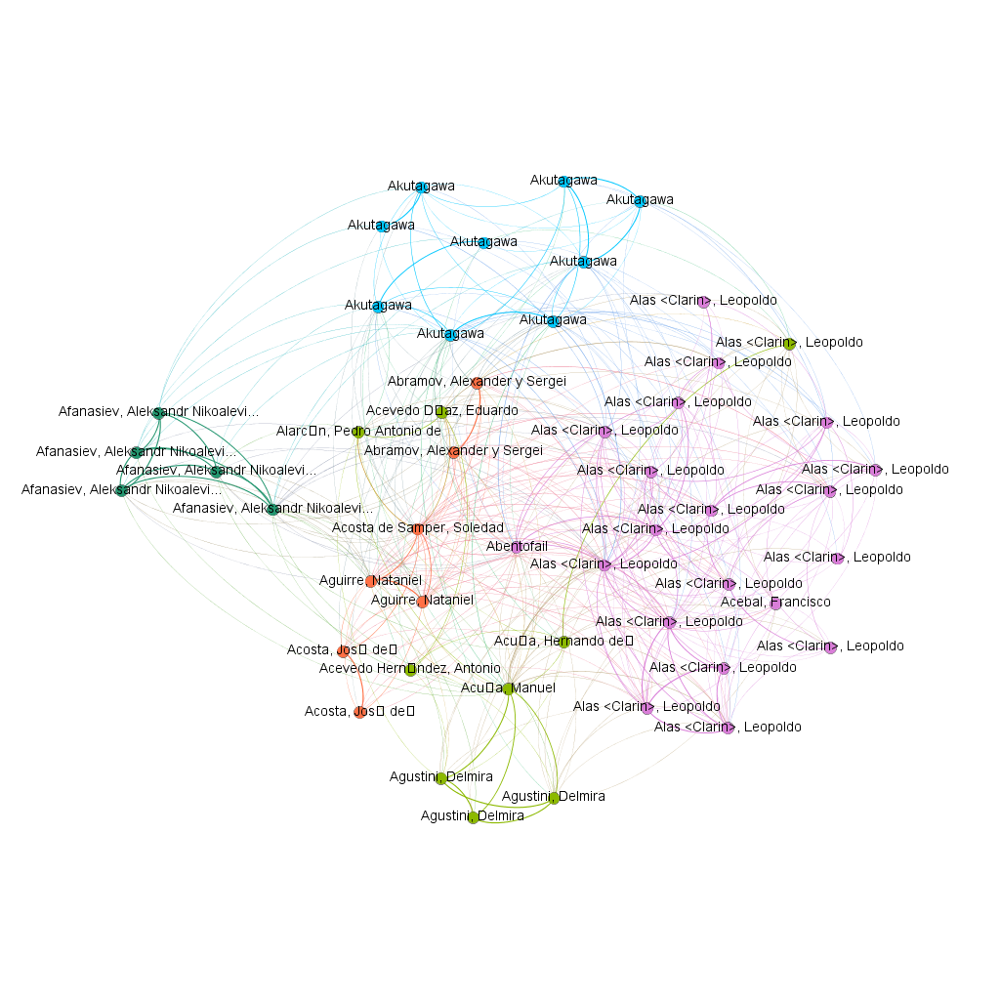
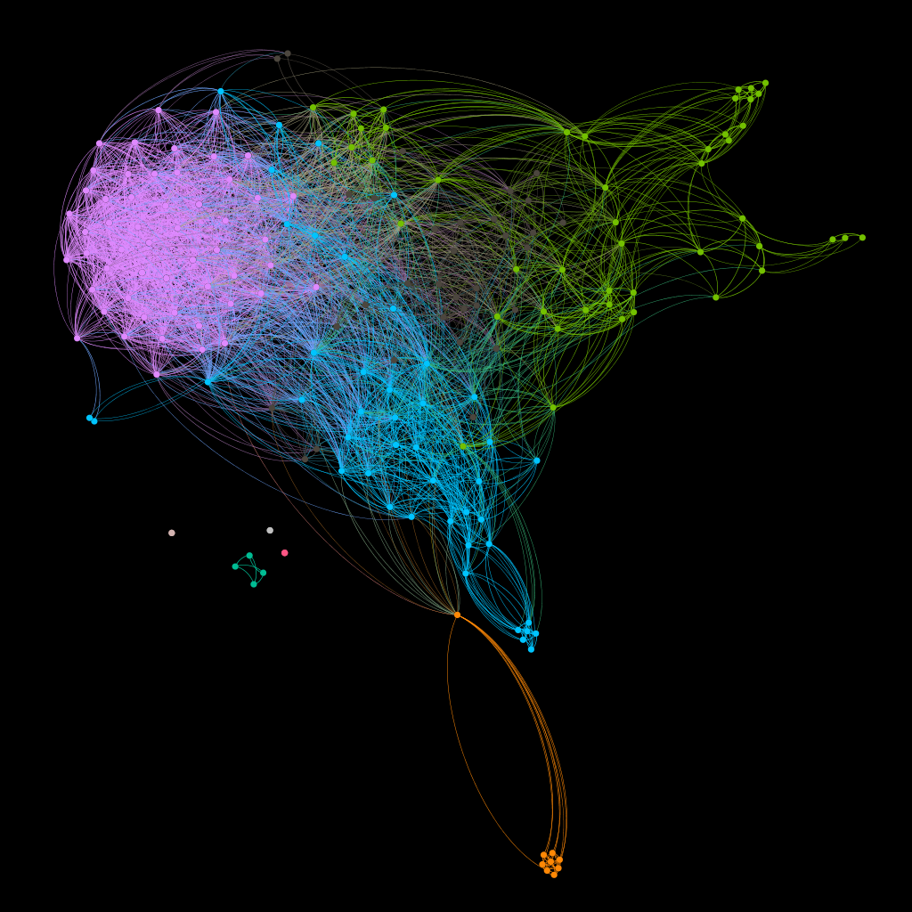

# Book Recommender.

Authors:  Álvaro Angulo, Lucía Manzoro, Juan José Martín, Álvaro Sanchez.

## Introduction:
We obtanined a set of books from www.leemp3.com .  Once we have these books we can use the metadata and the similitudes between 
the books to make a recommendation. We also can make visualizations (gephi) which allow us to see the diferents groups 
of books.

## Steps:

 This process is better explained in spanish in Memoria_recomendador.pdf.

### Data scraping: 

In scraping.py we can see the steps to obtain the books in .txt format.

### Recommender:

In funciones.py we can see how to make the recommender, we have done it using tf-idf and LDA technics (and using metadata).

### Visualization:

In visualizacion.py are explained the steps to make a graph which allow us to visualize this high dimensional data (other options are 
make clusters analysis and PCA). In visualizacion/grafo200libros.gephi we see an exaple, and bellow we see two results.

